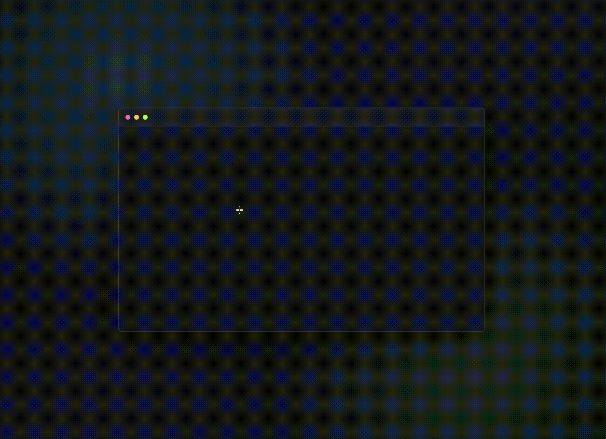

# BiuEditText

BiuEditText 是一个带“重力落字”效果的前沿输入控件：输入字母或中文时，字符会从页面底部跳出，先飞到高于光标的位置，再沿抛物线掉落到光标处。



## 快速接入

引入样式和脚本：

```html
<link rel="stylesheet" href="./styles.css" />
<script src="./script.js"></script>
```

在页面里放一个容器即可：

```html
<div data-biu-input data-placeholder="Type here..."></div>
```

脚本会自动初始化所有带 `data-biu-input` 的元素，并创建内部编辑器和动画 Canvas。

## 手动初始化

如果你想在 JS 中控制初始化：

```html
<div id="comment-box"></div>

<script src="./script.js"></script>
<script>
  const editor = BiuEditText.mount("#comment-box", {
    placeholder: "说点什么...",
    autoFocus: true,
    arcHeight: [180, 280],
  });

  editor.setValue("Hello");
  console.log(editor.getValue());
</script>
```

## 配置项

```js
BiuEditText.mount("#target", {
  ariaLabel: "Biu input",
  autoFocus: false,
  placeholder: "Type here...",
  palette: ["#ffffff", "#7cf8ff", "#b9ff8b", "#ffd36a", "#ff7b9b"],
  arcHeight: [170, 260],
  maxFliers: 120,
  maxParticles: 180,
});
```

## 实例方法

```js
const editor = BiuEditText.mount("#target");

editor.focus();
editor.getValue();
editor.setValue("新的内容");
editor.destroy();
```

## 实现拆解

1. 输入本体使用 `contenteditable`，保持真实文本编辑能力。
2. 视觉层使用全页面 `position: fixed` 的透明 `canvas`，设置 `pointer-events: none`，不拦截输入。
3. 在 `beforeinput` 中拦截普通字符输入，先在光标处插入透明占位字符，占住最终落点。
4. 读取占位字符的 `getBoundingClientRect()` 作为目标位置，从页面底部生成同样的飞行字符。
5. 先计算一个高于光标的最高点 `apexY`，再根据 `startY -> apexY -> targetY` 反推初速度和飞行时长，让字符一定越过光标高度后再下落。
6. 抵达后隐藏的占位字符显形，并触发短暂的落地发光反馈。
7. 中文输入通过 `compositionstart` / `compositionend` 处理：候选词确认后删除浏览器直接插入的文本，再逐字触发落字动画。

## 运行 Demo

直接打开 `index.html` 即可运行。
